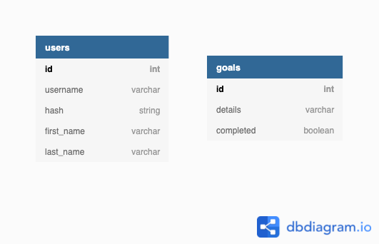

# Resolute

Resolute
<br>
meaning : admirably purposeful, determined, and unwavering.

## Final Project

Resolute is a New Year Resolution app that helps you keep track of your goals and resolutions.
New Year's resolutions are essential and should be set with the right mindset and attitude.
With Resolute this will help the user set their resolution in a measurable, attainable and realistic form. So ditch the pen and paper and try out Resolute.

<br>

## The Tech

- React
- Redux
- Express
- Knex.js (SQL)
- External API
- Auth0

<br>

## Roles

| Roles         | Name                          |
| ------------- | ----------------------------- |
| Product Owner | Geoffrey Sciascia             |
| Scrum Master  | Sam WP                        |
| Git Lead      | Evelyn Tan                    |
| Backend Team  | Evelyn Tan and Jatinder Singh |
| Frontend Team | Sam WP and Geoffrey Sciascia  |
| Vibe Checker  | Jatinder Singh                |

<br>

## Wireframe


<br>

## User Stories

1. Login page:

- As a user I want to be able to log in or sign up.

2. Home Page:

- As a user I want to :-
  - be shown a motivational quote when I navigate to the home page.
  - have the option to log out.
  - be able to easily navigate to pages that allow me to view my current goals
  - be able to view my completed goals
  - be able to add a new goal.

3. Add Goals Page:

- As a user I want to :-
  - be able to add multiple goals.
  - be able to view the goals I am adding before submitting them.
  - be able to view, edit and delete the goals that I am adding.
  - be able to navigate to other pages.
  - have the option to log out.
  - be able to navigate to a page that allows me to view a list of all my goals (including the ones I just added).

4. My Goals Page:

- As a user I want to :-
  - be able to view a list of all of my goals.
  - be able to navigate to other pages.
  - be able to edit and delete my goals.
  - have the option to log out.
  - be able to mark a goal as complete and have it added to my list of completed goals.

5. Complete Goals Page:

- As a user I want to :-
  - be able to view a list of all my completed goals.
  - be able to navigate to other pages.
  - have the option to log out.
  - have the option to delete my completed goals?

<br>

## Actions

#### goals

| Type        | Data  | Purpose                                                   |
| ----------- | ----- | --------------------------------------------------------- |
| ADD_GOALS   | goals | add a goal to the db and store in redux                |
| GET_GOALS   | goals | retrieve all goals from db and store in redux             |
| DEL_GOALS   | goals | delete a goal from the db and remove from store in redux |
| PATCH_GOALS | goals | update a goal in the db and store in redux                  |

<br>

## API (Client - Server)

| Method |       Endpoint       | Protected |         Usage          |                      Response                      |
| ------ | :------------------: | :-------: | :--------------------: | :------------------------------------------------: |
| GET    |   `/api/v1/goals`    |    Yes    |   Get all user goals   |             An Array of Goal Objects              |
| POST   |   `/api/v1/goals`    |    Yes    |    Save user goals     |       An Array of Goal Objects saved to db        |
| PATCH  | `/api/v1/goals/:id ` |    Yes    |    Edit user goals     | An Array of Goal Objects saved to db with changes |
| DEL    | `/api/v1/goals/:id ` |    Yes    |   Delete user goals    |             An Array of Goals Objects              |
| GET    |  `/api/v1/quotes `   |    No     | Get inspirational quotes |             An Array of Quotes Objects             |

<br>

## DB Diagram


<br>

## Heroku

Link here
<br>

## Setup

```
npm install
npm run knex migrate:latest
npm run knex seed:run
npm run dev

```
